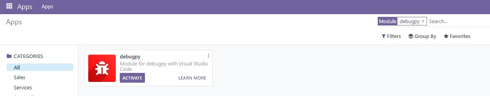

# GitHub Codespaces ♥️ Odoo sample

Trying to support both GitHub Codespaces and local Dev-Containers

A bug in local dev-containers:
>NOENT: no such file or directory, lstat no such file /root/.vscode-dev-container' .... node_modules/vscode-dev-containers/container-features\

*Workaround:* install older version `v0.299.0` of extension `ms-vscode-remote.remote-containers`, see [microsoft/vscode-remote-release ISSUE "ENOENT: no such file or directory"](https://github.com/microsoft/vscode-remote-release/issues/6844#issuecomment-1252288457)
## Odoo login
User: admin\
Pass: admin

## Pgadmin connection setup
Host: db\
Database: odoodb\
User: odoo\
Pass: myodoo

## Odoo server log in terminal
tail -f /var/log/odoo/odoo-server.log 

## Enable debug
Search for module debugpy and activate it

Ready to start debugger

